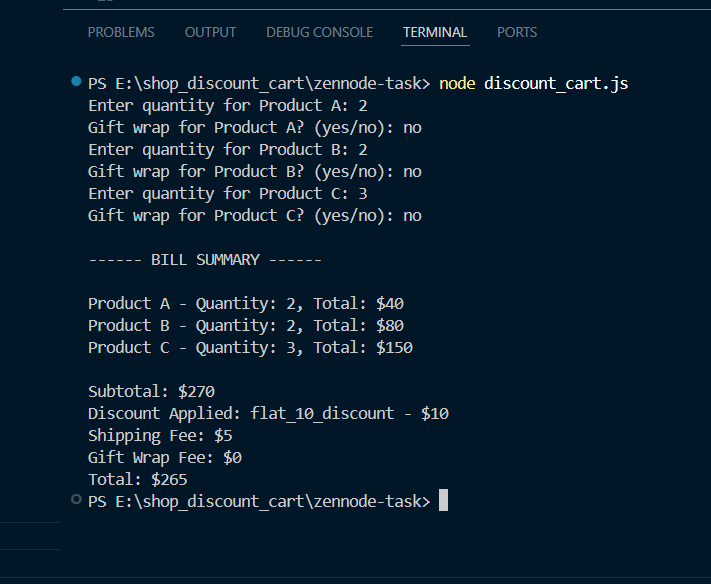
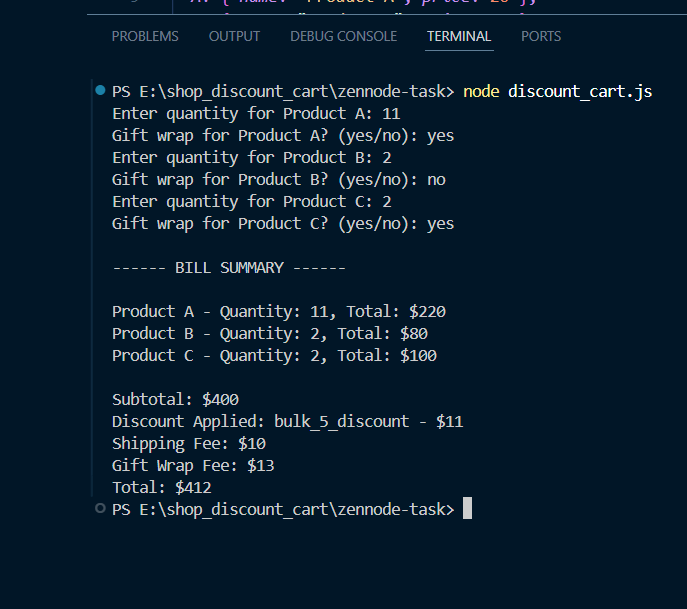
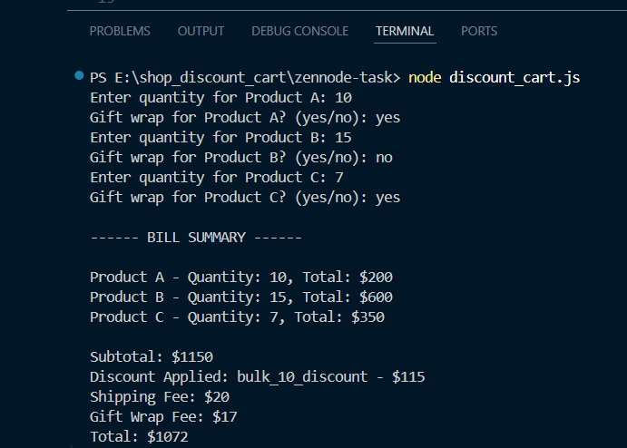
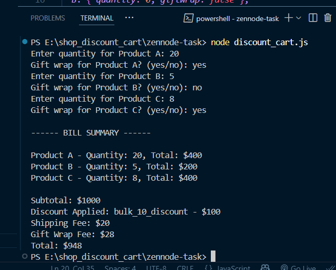

# 🛒 Shopping Discount Cart - Zennode Task

This is a Node.js-based command-line application that simulates a shopping cart with quantity-based discounts, gift wrap fees, and shipping charges. This task was completed as part of the Zennode interview process.

## ✅ Features

- Accepts quantity and gift wrap info for **Product A**, **Product B**, and **Product C**
- Calculates:
  - Subtotal
  - Applies best discount from 4 types
  - Shipping fees based on number of items
  - Gift wrap fee per product
- Outputs a detailed **bill summary**

---

## 💸 Discount Rules Applied

| Discount Type          | Condition                                             |
|------------------------|--------------------------------------------------------|
| `flat_10_discount`     | If subtotal > $200, apply $10 discount                |
| `bulk_5_discount`      | If quantity of any product > 10, apply 5% on that item|
| `bulk_10_discount`     | If total quantity > 20, apply 10% on subtotal         |
| `tiered_50_discount`   | If total quantity > 30 & any product > 15, apply 50% discount to the quantity above 15 for that product |

Only **one best discount** is applied per order.

---


## 📦 Output Example

```bash

Enter quantity for Product A: 10
Gift wrap for Product A? (yes/no): yes
Enter quantity for Product B: 15
Gift wrap for Product B? (yes/no): no
Enter quantity for Product C: 7
Gift wrap for Product C? (yes/no): yes

------ BILL SUMMARY ------
Product A - Quantity: 10, Total: $200
Product B - Quantity: 15, Total: $600
Product C - Quantity: 7, Total: $350

Subtotal: $1150
Discount Applied: bulk_10_discount - $115
Shipping Fee: $20
Gift Wrap Fee: $17
Total: $1072

```


---

## 🖼 Output Screenshots

| Scenario | Screenshot |
|---------|------------|
| Case 1 - Flat 10 Discount |  |
| Case 2 - Bulk 5 Discount |  |
| Case 3 - Bulk 10 Discount |  |
| Case 4 - Tiered 50 Discount |  |


---

## ⚙️ How to Run

1. Clone the repository
2. Install Node.js if not already installed
3. Open terminal and run:

```bash
node discount_cart.js
